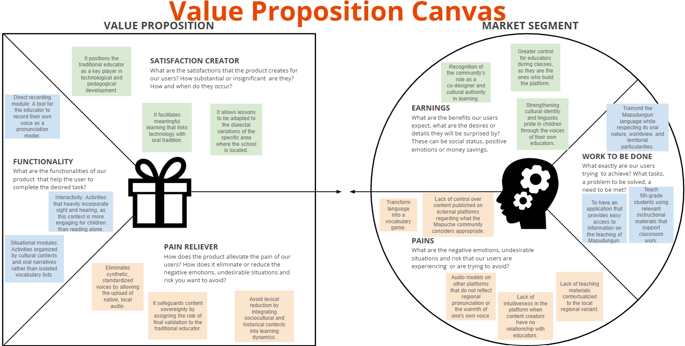
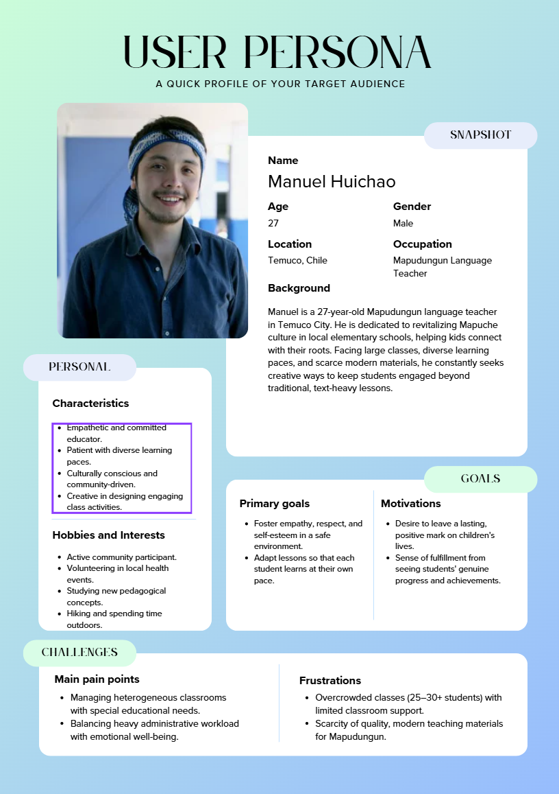
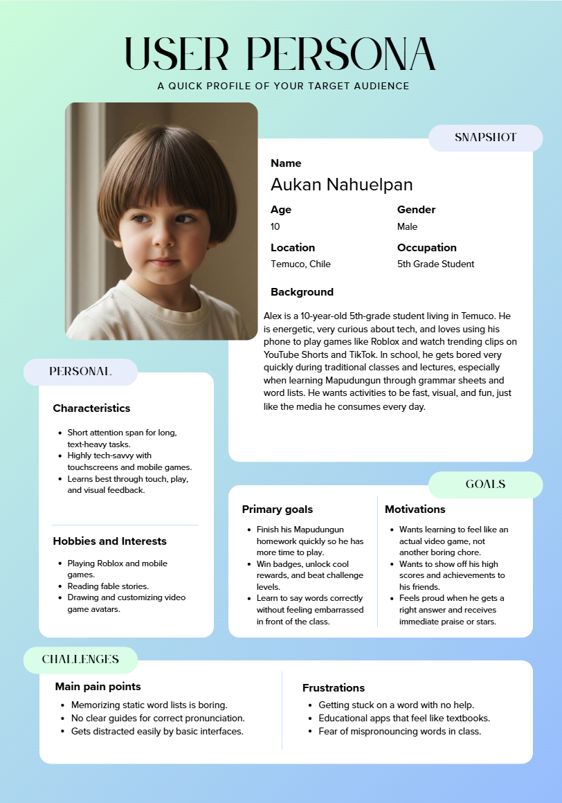
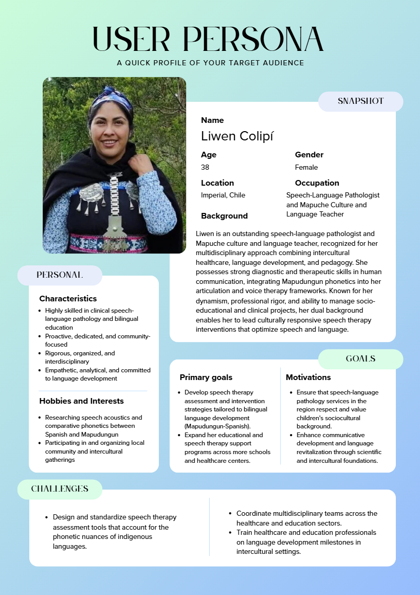

# Project UX

## Index

- [1. Introduction](#1-introduction)
- [2. Team](#2-Team)
- [3. Strategy](#3-strategy)
- [4. Solutions Scope](#4-solutions-scope)
<!--
- [5. Benchmark](#5-Benchmark)
- [6. Customer Journey Map](#6-customer-journey-map)
- [7. Navigation](#7-Navigation)
  - [7.1. Initial Aporach](#71-first-aproach)
  - [7.2. Improved Navigation](#72-improved-navigation)
- [8. Wireframes](#8-wireframes)
- [9. Mockups](#9-mockups)
  - [9.1. Initial Aproach](#91-initial-aproach)
  - [9.2. Improved Mockups](#92-improved-mockups)
-->

---

## 1. Introduction

---

## 2. Team

Diego Aido - Designer

Vicente Hernández - Researcher

Rocio Pérez - Project Manager

---

## 3. Strategy

---

## 4. Solutions Scope

---
<!--
## 5. Benchmark

---

## 6. Customer Journey Map

---

## 7. Navigation

### 7.1. First Aproach

### 7.2. Improved Navigation

---

## 8. Wireframes

---

## 9. Mockups

### 9.1. Initial Aproach

### 9.2. Improved Mockups

---
-->